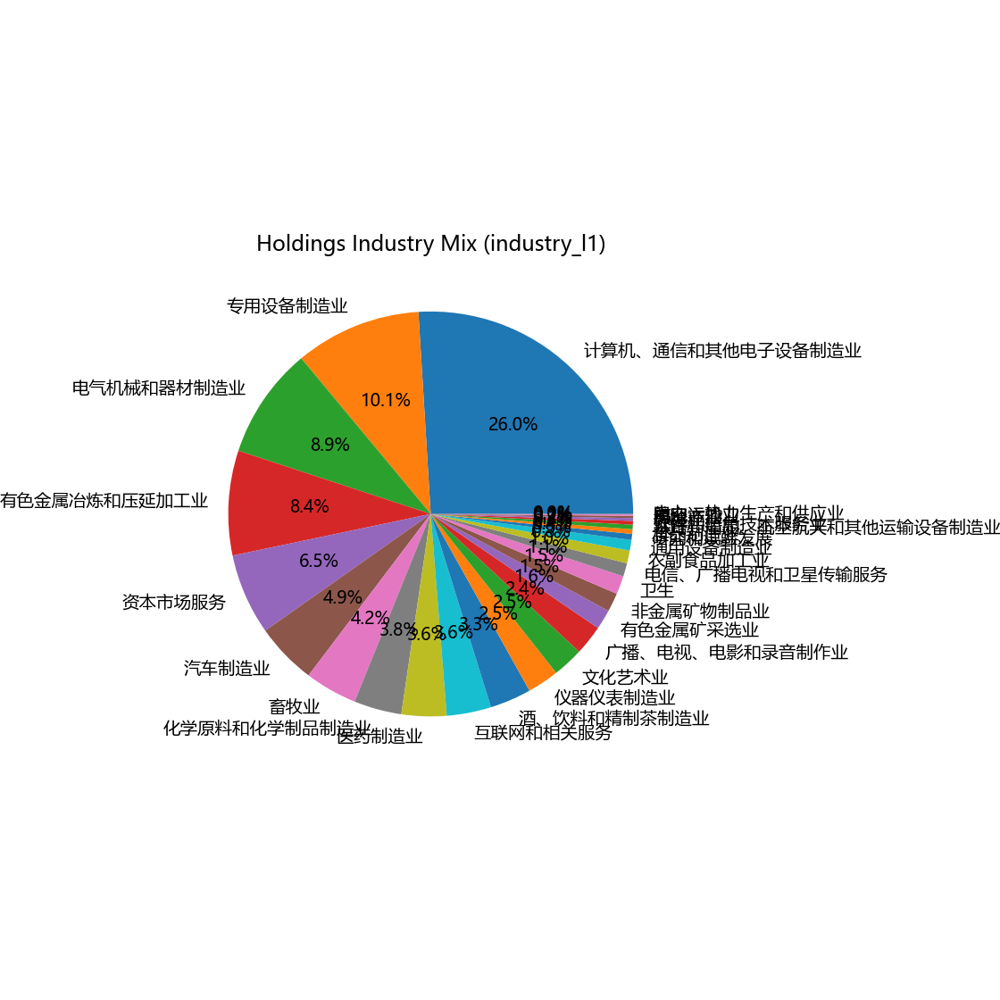
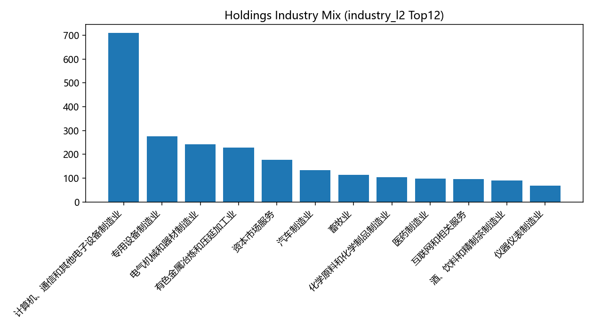
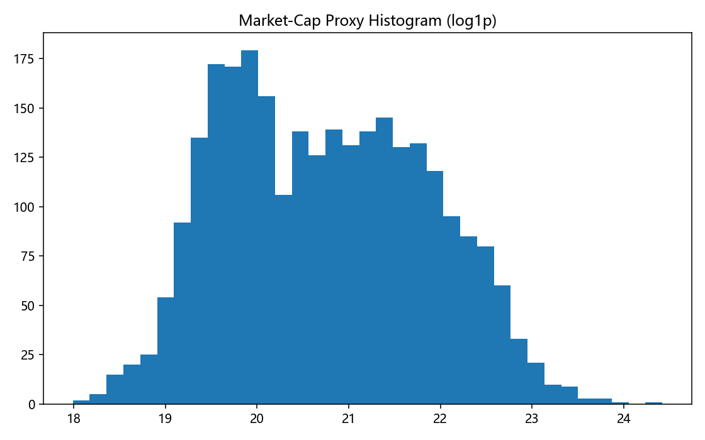
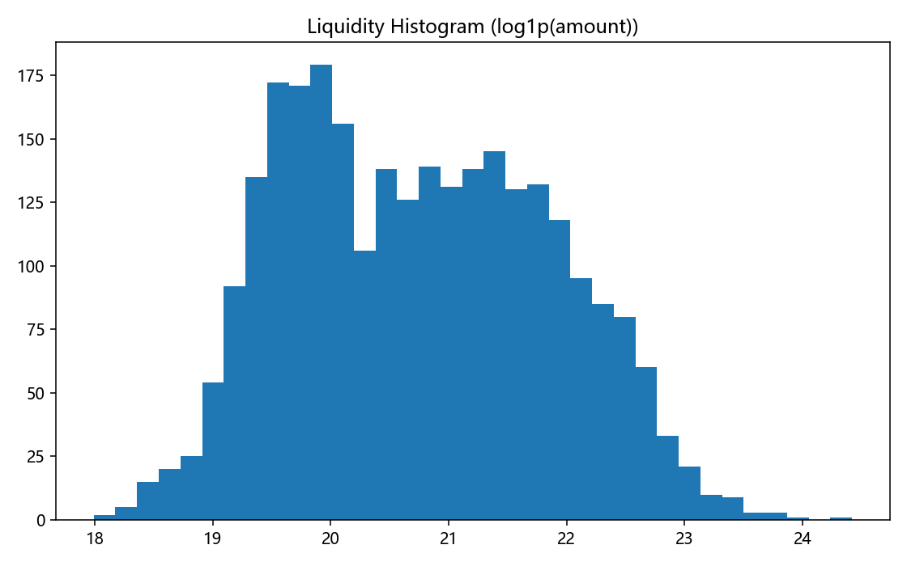
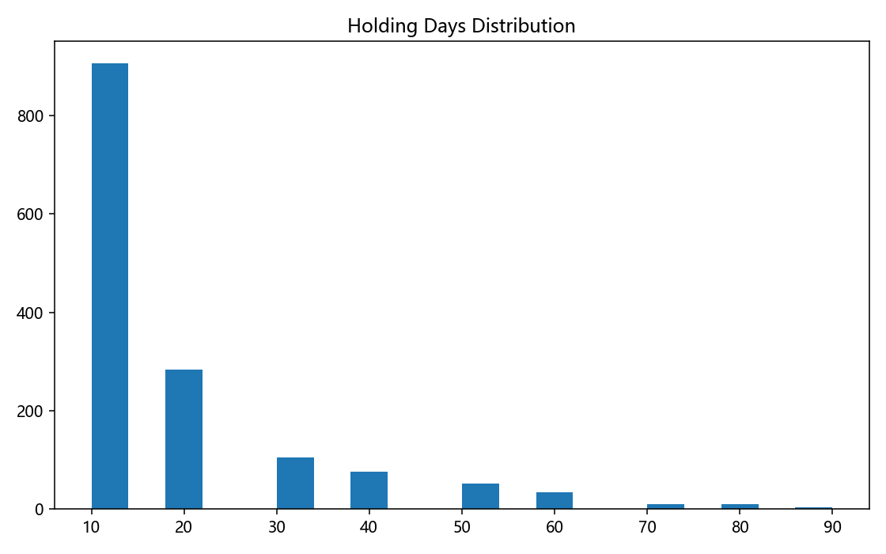

# baseline_v5 持仓偏好分析报告

## 图表

## 统计摘要

- 持仓样本数：2730
- 行业集中（industry_l1 Top3）：计算机、通信和其他电子设备制造业:709, 专用设备制造业:275, 电气机械和器材制造业:243
- 市值分布：{'中盘': 928, '小盘': 901, '大盘': 901}
- 成交额中位数：987103244.57
- 平均持有时间：18.47 交易日

## 选股偏好总结

- 策略偏好行业：计算机、通信和其他电子设备制造业/专用设备制造业；
- 偏好市值层级：中盘；
- 典型持有周期约 10 交易日（接近2周节奏）。