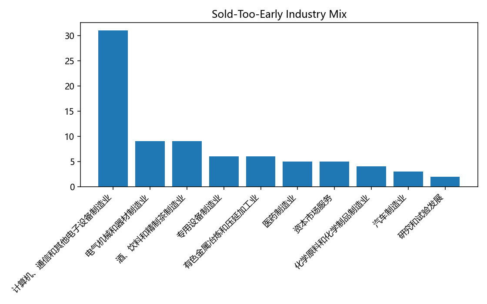
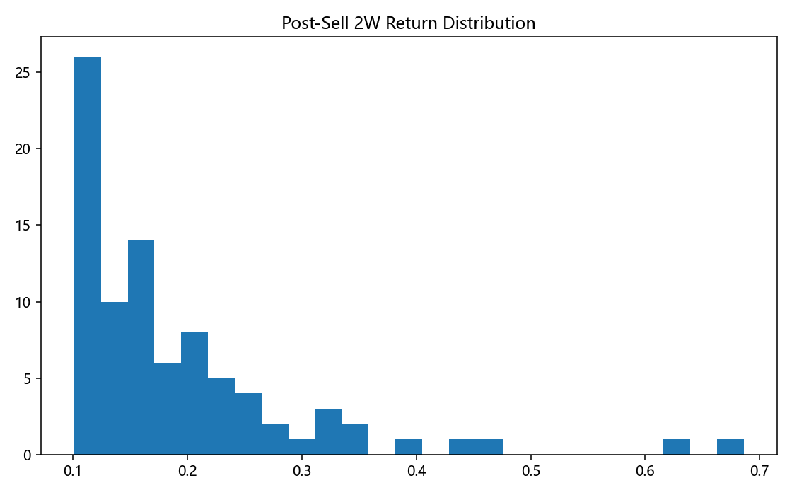

# baseline_v5 卖飞分析报告

- 卖出样本数：662
- 卖飞样本数：86
- 卖飞占比：12.99%

## 图表

## 卖飞原因与特征

- 当前策略没有止盈触发机制，卖飞原因主要来自调仓换出；
- 卖飞股票更集中于趋势延续行业时段，建议上涨市延长强势股持有窗口。

## 止盈优化建议

- 建议1：上涨市将止盈阈值上调到20%；
- 建议2：上涨市取消硬止盈，改为回撤止盈（如从高点回撤8%再退出）；
- 建议3：仅对非主线行业启用止盈，主线行业放宽。